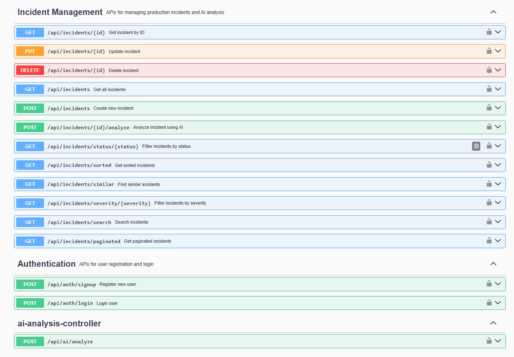

# CodeMortem 

AI-Powered Incident Management Platform built using Spring Boot, MySQL, JWT Authentication, and OpenRouter AI.

---

## Overview

CodeMortem is an AI-assisted incident management platform designed to help engineering teams create, manage, analyze, and resolve production incidents efficiently.

The platform leverages AI-powered operational analysis to generate:

* Incident Summaries
* Root Cause Analysis
* Immediate Mitigation Steps
* Debugging Checklists
* Long-Term Preventive Recommendations
* Risk Assessments

By combining incident tracking with AI-generated insights, CodeMortem helps reduce troubleshooting time and improve incident response workflows.

---

## Features

### Authentication & Security

* User Registration
* User Login
* JWT-Based Authentication
* Protected API Endpoints
* Spring Security Integration

### Incident Management

* Create Incidents
* View Incidents
* Update Incidents
* Delete Incidents
* Search Incidents
* Pagination Support
* Sorting Support
* Severity Classification
* Status Tracking

### AI-Powered Analysis

* AI-Assisted Incident Investigation
* Root Cause Suggestions
* Mitigation Recommendations
* Risk Assessment Generation
* Operational Debugging Guidance
* Structured Incident Reports

### Frontend

* Modern Landing Page
* Login & Registration UI
* Interactive Dashboard
* Incident Search
* AI Analysis View
* Responsive User Interface

### API Documentation

* Swagger/OpenAPI Documentation
* Interactive API Testing

---

## Tech Stack

### Backend

* Java 21
* Spring Boot
* Spring Security
* Spring Data JPA
* Hibernate
* JWT Authentication
* Maven

### Database

* MySQL

### Frontend

* HTML
* CSS
* JavaScript

### AI Integration

* OpenRouter API
* DeepSeek Chat Model

### Documentation

* Swagger/OpenAPI

---

## System Architecture

Controller
↓
Service
↓
Repository
↓
MySQL Database

AI Analysis Workflow

Incident
↓
Spring Boot Service
↓
OpenRouter API
↓
DeepSeek Model
↓
Structured AI Analysis
↓
Dashboard Display

---

## Core Workflow

Landing Page
↓
User Login / Registration
↓
Dashboard
↓
Create Incident
↓
Store Incident
↓
Analyze with AI
↓
Generate Operational Report
↓
Incident Resolution

---

## Screenshots

### Landing Page


### Login Page


### Dashboard


### Incident Details


### AI Analysis Report


### Swagger Documentation



---

## API Documentation

Swagger UI:

http://localhost:8080/swagger-ui/index.html

---

## Environment Variables

Create a `.env` file and add:

```env
OPENROUTER_API_KEY=your_openrouter_api_key
JWT_SECRET=your_jwt_secret
```

---

## Run Locally

### Clone Repository

```bash
git clone https://github.com/your-username/codemortem.git
```

### Navigate to Project

```bash
cd codemortem
```

### Configure Database

Create a MySQL database and update:

```properties
application.properties
```

with your database credentials.

### Configure Environment Variables

Create:

```env
.env
```

and add required keys.

### Run Application

```bash
mvn spring-boot:run
```

### Open Swagger

```text
http://localhost:8080/swagger-ui/index.html
```

### Open Frontend

```text
frontend/index.html
```

---

## Key Highlights

* Built a full-stack AI-powered incident management platform
* Implemented JWT-based authentication and authorization
* Developed RESTful APIs using Spring Boot
* Integrated OpenRouter AI for incident analysis
* Designed a modern dashboard using HTML, CSS, and JavaScript
* Implemented search, filtering, and incident lifecycle management
* Secured endpoints using Spring Security
* Documented APIs using Swagger/OpenAPI
* Followed layered architecture with DTO-based API design

---

## Future Enhancements

* Cloud Deployment
* Docker Support
* Team Collaboration Features
* Incident Timelines
* AI Incident Categorization
* Analytics Dashboard
* Notification System
* Multi-User Incident Assignment

---

## Project Motivation

Modern engineering teams often spend significant time investigating production incidents. CodeMortem was built to streamline this process by combining traditional incident management with AI-powered operational analysis.

The goal is to help engineers:

* Identify root causes faster
* Follow structured debugging workflows
* Reduce incident resolution time
* Improve operational efficiency

---

## License

This project is intended for educational, learning, and portfolio purposes.
